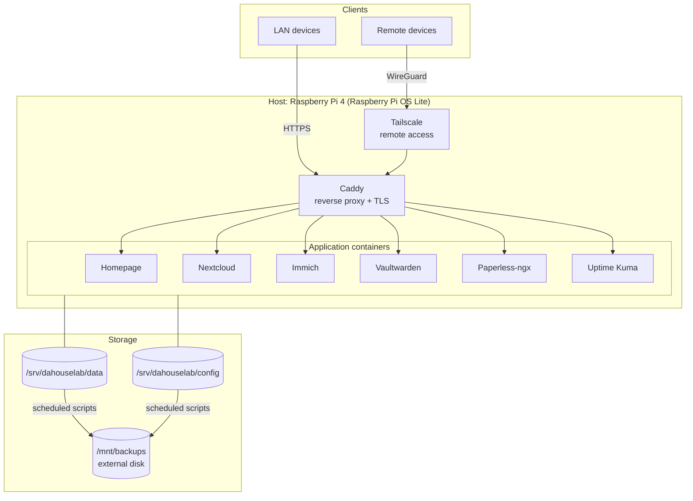

# Platform Overview

> Context: [vision](vision.md) · [principles](principles.md) · [hardware strategy](hardware.md) · [future plans](future-plans.md)

## Why this shape

daHouseLab is a single-node, Docker-first platform. One Linux host runs every service as a
container behind a single reverse proxy, reachable remotely only through a private VPN mesh.
This shape was chosen because it is the simplest architecture that is still fully reproducible,
migratable and secure — see [ADR-0003 (Docker First)](../decisions/0003-docker-first.md) and
[ADR-0005 (Raspberry Pi Platform)](../decisions/0005-raspberry-pi-platform.md).

The host is deliberately treated as **cattle, not a pet**: everything specific about it lives in
this repository, so replacing the hardware is a runbook
([migrate-to-mini-pc](../runbooks/migrate-to-mini-pc.md)), not a crisis.

## System diagram

## Layers

Dependencies always point downward: higher layers may depend on lower layers, never the reverse,
and never on another layer's implementation details.

| Layer            | Component                        | Replaceable by                             |
| ---------------- | -------------------------------- | ------------------------------------------ |
| Hardware         | Raspberry Pi 4 + SSD             | Any Linux-capable machine (Mini PC)        |
| Operating system | Raspberry Pi OS Lite (64-bit)    | Debian/Ubuntu Server (same runbooks apply) |
| Runtime          | Docker Engine + Compose plugin   | Fixed by [ADR-0003](../decisions/0003-docker-first.md) / [ADR-0004](../decisions/0004-docker-compose.md) |
| Ingress          | Caddy                            | Any reverse proxy (isolated behind one service directory) |
| Remote access    | Tailscale                        | Any WireGuard-based mesh                   |
| Applications     | One directory per service in [`/services`](../../services/) | Independently deployable/removable |

## Key properties

- **Single ingress point.** Only Caddy publishes ports on the host. Applications attach to the
  internal `proxy` Docker network and are never exposed directly.
- **No public exposure by default.** Remote access is via Tailscale; nothing is port-forwarded on
  the home router. See [`../security/`](../security/README.md).
- **Config/data separation.** Runtime config and application data live outside Git and outside the
  repo, on paths owned by the platform, so services can be rebuilt without touching data.
  See [ADR-0008](../decisions/0008-configuration-data-separation.md).
- **Backups leave the machine.** Data is copied to an external disk; the repo itself is backed up
  by being a Git remote clone. See [`../backup/`](../backup/README.md).

## What this architecture is *not*

- Not high-availability. A single node is an accepted tradeoff (documented in
  [ADR-0005](../decisions/0005-raspberry-pi-platform.md)); the mitigation is fast, documented
  rebuild — not redundancy.
- Not Kubernetes. Compose is sufficient at this scale and dramatically simpler to operate
  ([ADR-0004](../decisions/0004-docker-compose.md)). Revisit if node count exceeds one.
